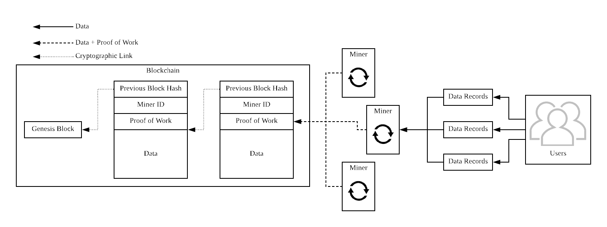

# Decentralized Storage of Medical Data

###### Luke Stanislawski - psyls6@nottingham.edu.cn

>This project is being undertaken as part of a final year project of a computer science undergraduate degree at The University of Nottingham Ningbo, China.

## Abstract

Storing medical data in lone databases is inconvenient for both patients and medical professionals, as well as being prone to security risks and error. Doing so also makes collation of large datasets, and therefore research through data mining inherently hard. This project proposes a solution that accommodates for the realities of global distrust and differing interests. One that recognises the rational choices of the individuals, as well as the importance of their sacrifice. And, one that is sustainable given limitations of technologies such as blockchain.

## Background and Motivation

The increase in data harvesting and storage in recent years has led to an increase in the widespread development of artificial intelligence systems for statistical analysis and pattern recognition on large datasets for the purpose of improving healthcare. Consequentially, conversations about the trade off between medical research and the privacy rights of the individual have become mainstream.[3]

Currently a great barrier stopping many medical professionals from improving and learning from their experiences is the lack of accurate and timely feedback from their patients.[1] A radiologist who has just given a diagnosis will most likely never know how accurate it was 10 or 20 years on, or be able to consider whether or not the patient’s smoker status changed, or how their weight varied. Medical professionals who do not accurate and timely feedback, develop skills through experience slower than those who do. Doctors do not have access to many thousands of complete medical records of persons who had undergone a given treatment, complete with SPECT or MRI scans, ECG, and other detailed health data. They are limited in both the number of procedures they can undertake in their finite career, as well as the complexity and detail of patterns from which they are able to draw conclusions and hence develop improvements.

### Looking Ahead

With large datasets, AI systems facilitate data analysis, that can divulge complex patterns linking specific practices/decisions undertaken during treatment of individuals, with significant outcomes and degrees of success that would otherwise not be uncovered, allowing newly discovered practices to be adopted, and improving healthcare.[4] They are able to examine in detail orders of magnitude more medical records than human doctors can in their finite careers, learning and improving from each one, allowing them to give more accurate diagnosis and recommendations of treatment.

Having a decentralized, international medical database available to all could see a great surge in improvement of medical practices. The ability to compare the short-term and long-term outcomes of treatments being performed in vastly different locations around the world, would allow analysis of the strength and weakness of vastly varying and diverse institutions and serve as a major catalyst for improvement.[5]

### Technologies

Blockchain technology allows records to be stored in a decentralized manner, such that data is resilient to modification through verification by the largest pool of CPU power in the network.[2] As long as the largest pool consists of parties who do not trust one another, data is verified as being part of the *agreed truth*. Digital signatures ensure the authenticity of the data source, whilst cryptographic hashes combined with a proof of work (nonce) make it exponentially harder to change any given data on the blockchain, with every new block added.

All data on the blockchain is visible to everyone, making it ideal for sharing data reliably between many untrusted parties, without a central authority. Data can also exist on the blockchain but remain unreadable to the majority via the use of encryption, this makes it suitable for storing private medical data that can be accessed by the owner equally as easily from any part of the network.

### Challenges

One of the greatest problems arising from blockchain technology is that every node must keep a copy of the entire blockchain, going back to the genesis block.[2] This makes it very unsuitable storing large amounts of data, as in our case, every medical institution would have to store not only data they produce, but also all medical data every other institution on the network produces.

Blockchain also continuously requires a large amount of processing power in order to maintain the security of the network.[6] Vast amounts of processing power require the consumption of vast amounts of electricity. Not only does this tie the maintenance costs of the network closely to the price of electricity, making it very sensitive to fluctuations in the energy industry, but also negatively affects the environment. Both of these two factors could make it harder to encourage the widespread adoption of a system.

This not only decreases the practicality of the network, as it requires the system designers to find motivation for parties to spend money on maintaining the network. This usually comes in the form of a monetary reward, a cost which will most likely be recovered from the individuals who use the network, either as a transfer of money or sale of personal data.

How then do we store data in an efficient decentralised manor such that it's validity and integrity can be verified without consuming copious amounts of computing power to maintain it?

## Previous Work

KSI blockchain technology is currently in use by the nation of Estonia to store cryptographic hashes of time stamped data stored on servers in various locations within and outside of the country.[7,8] This is a common approach for handling the access controls or confirming the validity of data without decentralized storage of the data itself. This approach works well under the following assumptions:

1. All the servers used to store data have a common interest
2. The medical data is adequately backed up

While this approach may be possible under a single government, it would be much harder to guarantee the security and integrity of data across international boarders in a truly decentralized system. This is because the blockchain can only prove the time a record was created and the author of said record, and also relies on a central time-stamping server.[8] Any one data silo has the absolute power to control access permissions to the data it holds. Therefore indiscriminate access to standardised data by researchers or the individuals cannot be guaranteed.

## Aims and Objectives

The aim of this project is to design an algorithm capable of storing records on a blockchain such that they can be analysed on a macroscopic level, remain anonymised to anyone who does not have permission to know the identity of the individual the data is pertaining to, and remain useful to, and in the control of the individual. The system would have to facilitate the motivation of individuals to opt to share their (anonymised) data, be it through monetary gain or merely increased security/convenience.

The key objectives for this project are as follows:

- Investigate ways of storing data on a blockchain in such a way that it is not readable to every party.
- Design and implement an algorithm that can store records cryptographically securely in such a way that they can only be traced back to the subject by a party whom has permission from the data owner.

## Works Cited

1. Daniel Kahneman.*Thinking Fast And Slow*.  Farrar, Straus and Giroux, 2011.
2. Satoshi Nakamoto.  *Bitcoin:  A peer-to-peer electronic cash system*.  2008.
3. Marc Pilkington.  *Can blockchain improve healthcare management?*
4. The Economist.  *Rise of the machines*.  2015.
5. Mandl KD Weitzman ER, Kaci L. *Sharing medical data for health research: The earlypersonal health record experience*.  2010.
6. Melanie Swan. *Blockchain*. 2015.
7. Priit Martinson. *Estonia – the Digital Republic Secured by Blockchain*. 2019.
8. Guardtime-Federal. *https://www.guardtime-federal.com/ksi/*. Accessed 2019.